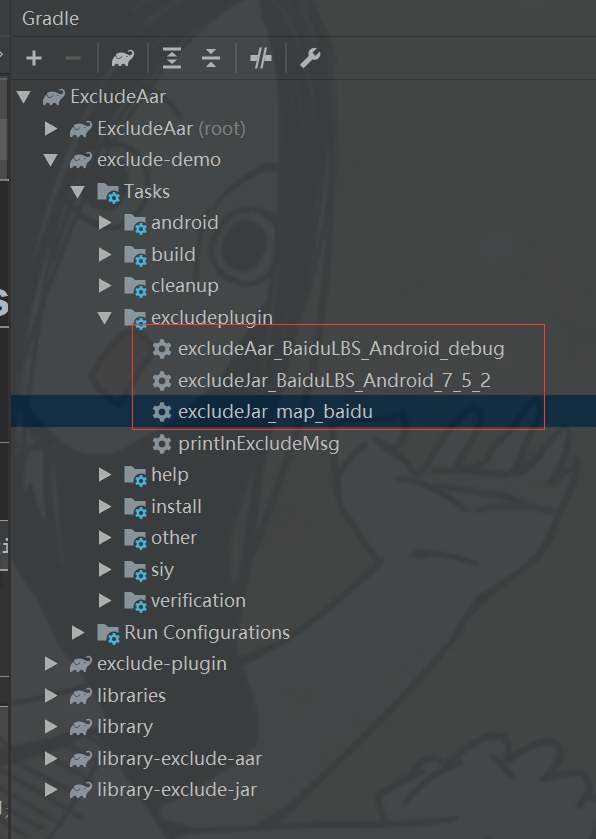

# 用于过滤aar中冲突类(class)和so库的脚本,也可以用来过滤jar中冲突class
## Jcenter地址
依赖：
```grdle
classpath 'coder.siy:exclude-dependencies-plugin:1.0.0'
```
## 使用方法
```gradle
 apply plugin: 'exclude_plugin'

 excludePluginExt {
        autoDependencies = true //是否自动依赖即是否依赖过滤之后的架包
        aars {
            BaiduLBS_Android_debug { //过滤架包的名称
                path "/libs/exclude/BaiduLBS_Android_debug.aar" //架包的路径
                excludePackages 'com.baidu.location' //过滤的包名
            }
        }
        jars{
            BaiduLBS_Android_7_5_2{//过滤架包的名称
                path "/libs/exclude/BaiduLBS_Android_7.5.2.jar" //架包的路径
                excludePackages 'com.baidu.android','com.baidu.lbsapi' //过滤的包名
            }

            map_baidu{//过滤架包的名称
                path "/libs/exclude/map-baidu.jar"//架包的路径
                excludePackages "io.dcloud.js.map.adapter"//过滤的包名
                excludeClasses "io.dcloud.js.map.IFMapDispose","io.dcloud.js.map.JsMapCircle","io.dcloud.js.map.MapJsUtil"//过滤的类名
            }
        }
    }
```
## 注意：
配置完之后运行一下根据名称生成的过滤任务


## 属性解释
| 属性名 | 默认值 | 解释 |
|:--:|:--:|:--:|
|path|无默认值(必要值)|路径|
|excludePackages|空数组|需要过滤的包名|
|excludeClasses|空数组|需要过滤的类名(全类名，不要".class"结尾)|
|excludeSos|空数组|需要过滤的so名（不要".so"结尾,aar包特有）|

## Demo截图


可以看到图一中的百度包被过滤掉了

## AAR包过滤冲突class和so库怎么实现
1，获取到需要过滤的原始AAR包

2，解压AAR包

3，解压AAR包中所包含的jar

4，删除解压AAR包中包含的jar

5，按照过滤规则对解压之后的class文件按重新打包(AAR的class文件过滤在这里实现的)

6，按照过滤规则重新打包成AAR包(AAR的SO文件过滤在这里实现的)

7，创建一个新的Configuration并且添加一个Artifact

8，在工程中引用过滤后的AAR

## ① 获取到需要过滤的原始AAR包
```Groovy
def getDefaultAar() {
    Configuration c = configurations.getByName("default")
    def files = c.artifacts.files.filter {
        it.name ==~ /.*\.aar/
    }

    def file = null
    if (!files.empty) {
        file = files[0]
    }
    return file
}
```
## ② 解压AAR包
```Groovy
/**
 * 解压getDefaultAar()返回的aar包
 */
task unZipAar(type: Copy) {
    from zipTree(getDefaultAar())
    into unZipAarFile
    //完成aar解压之后，设置unzipJar的from和deleteJars的delete
    doLast {
        Set<File> jarFiles = new HashSet<>()
        if (unZipAarFile.exists()) {
            unZipAarFile.traverse(type: groovy.io.FileType.FILES, nameFilter: ~/.*\.jar/) { file ->
                jarFiles.add(file)
            }
        }
        unzipJar.from(
                jarFiles.collect {
                    zipTree(it)
                }
        )
 
        deleteJars.delete(jarFiles)
    }
}
```
就是直接把aar包解压了，为什么可以解压aar包呢？因为“AAR文件的文件扩展名为 .aar，文件本身是一个强制性条目的zip文件”，详细解释请看[这里](https://developer.android.google.cn/studio/projects/android-library#aar-contents)
## ③ 解压AAR包中所包含的jar
```Groovy
/**
 * 注意：from 已经在上面的unZipAar设置了
 * 解压aar包中包含的jar包
 */
task unzipJar(type: Copy) {
    into unZipJarFile
}
```
为什么可以解压jar包呢？因为“JAR文件是一种归档文件，以ZIP格式构建，以.jar为文件扩展名”，详细解释请看[这里](https://zh.wikipedia.org/zh-hans/JAR_(%E6%96%87%E4%BB%B6%E6%A0%BC%E5%BC%8F))
## ④ 删除解压之后的jars
```Groovy
/**
 *
 * 注意：from 已经在上面的unZipAar设置了
 * 删除解压之后的jars
 */
task deleteJars(type: Delete)
```
## ⑤ 按照过滤规则对解压的class.jar重新打包(这个是重点)
```Groovy
/**
 * 用Jar任务过滤并生成新的jar包
 */
task zipJar(type: Jar) {
    baseName = 'classes'
    from unZipJarFile
    destinationDir unZipAarFile
    exclude getExcludePackageRegex(excludePackages)
    exclude getExcludeClassRegex(excludeClasses)
}
```
这个步骤就是把之前解压的class文件，按照过滤规则用Jar重新打包成jar文件
## ⑥ 重新打包成AAR包
```groovy
/**
 * 重新把文件压缩成新的aar包
 */
task excludeAar(type: Zip) {
    group 'Siy'
    description '生成一个过滤之后的aar包'
    baseName excludeAarName
    extension "aar"
    from unZipAarFile
    exclude getExcludeSoRegex(excludeSos)
    destinationDir excludeAarFile
}
````
这个步骤过滤so，并且重新打包 成aar文件
## ⑦ 创建一个新的Configuration并且添加一个Artifact
```Groovy
configurations.maybeCreate("exclude")
artifacts.add("exclude",excludeAar)
```
## ⑧ 在工程中引用过滤后的AAR
```Groovy
implementation project(path: ':xxx_aar', configuration: 'exclude')
```
## 过滤规则
```Groovy
//需要过滤的包名
String[] excludePackages = ['com.baidu']
//需要过滤的类(需要全类名,不需要.class结尾)
String[] excludeClasses = []
//需要过滤的so
String[] excludeSos = ['liblocSDK7b']

static String[] getExcludePackageRegex(String[] packages) {
    packages?.collect {
        it?.replace('.', '\\')?.plus("\\**")
    }
}

static String[] getExcludeClassRegex(String[] classes) {
    classes?.collect {
        it?.replace('.', '\\')?.plus(".class")
    }
}

static String[] getExcludeSoRegex(String[] sos) {
    sos?.collect {
        "**\\${it}.so"
    }
}
```

## JAR包过滤冲突class包怎么实现
1，获取到需要过滤的原始JAR包

2，解压JAR包

3，按照过滤规则对解压的class文件重新打包

4，创建一个新的Configuration并且添加一个Artifact

5，在工程中引用过滤后的JAR

## ① 获取到需要过滤的原始JAR包
```groovy
def getDefaultJar() {
      Configuration c = configurations.getByName("default")
      def files = c.artifacts.files.filter {
          it.name ==~ /.*\.jar/
      }
 
      def file = null
      if (!files.empty) {
          file = files[0]
      }
    return file
}
```
## ② 解压JAR包
```groovy
/**
 * 解压getDefaultJar()返回的jar文件
 */
task unzipJar(type: Copy) {
    def zipFile = getDefaultJar()
    def outputDir = unZipJarFile
    from zipTree(zipFile)
    into outputDir
}
```
## ③ 按照过滤规则对解压的JAR重新打包
```groovy
/**
 * 用Jar任务过滤并生成新的jar包
 */
task excludeJar(type: Jar) {
    group 'Siy'
    description '生成一个过滤之后的jar包'
 
    //需要打包的资源所在的路径集和
    from unZipJarFile
 
    //去除路径集下部分的资源
    exclude getExcludePackageRegex(excludePackages)
    exclude getExcludeClassRegex(excludeClasses)
 
    //整理输出的 Jar 文件后缀名
    extension = "jar"
 
    //最终的 Jar 文件名......如果没设置，默认为 [baseName]-[appendix]-[version]-[classifier].[extension]
    baseName = excludeJarName
 
    //生成jar包的路径
    destinationDir excludeJarFile
}
```
## ④ 创建一个新的Configuration并且添加一个Artifact
```groovy
configurations.maybeCreate("siy_test")
artifacts.add("siy_test", zipJar)
````
## ⑤ 在工程中引用过滤后的JAR
```groovy
implementation project(path: ':test_jar_exclude', configuration: 'siy_test')
```
## 过滤规则
```groovy

//需要过滤的包名
def excludePackages = ['com.baidu']
//需要过滤的类(需要全类名)
def excludeClasses = []
 
static def getExcludePackageRegex(def packages) {
    packages?.collect {
        it?.replace('.', '\\')?.plus("\\**")
    }
}
 
static def getExcludeClassRegex(def classes) {
    classes?.collect {
        it?.replace('.', '\\')?.plus(".class")
    }
}
```

详细介绍请看[这里](https://blog.csdn.net/baidu_34012226/article/details/80104771)
