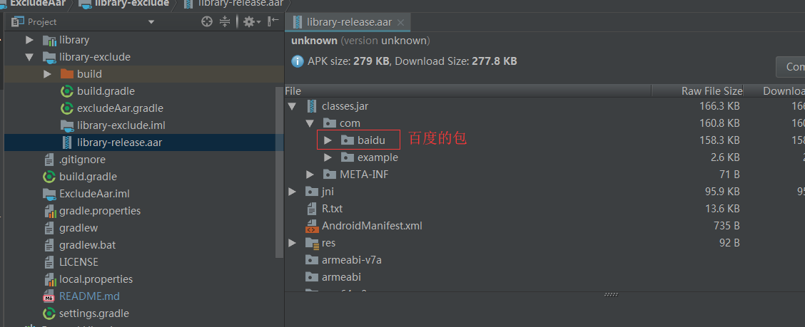
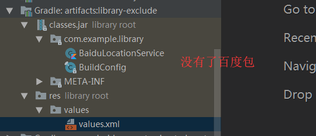

# 一个用于过滤AAR(Jar)包中冗余或者冲突类的gradle脚本

## Demo截图




可以看到图一中的百度包被过滤掉了

## 如何实现的
1，获取到需要过滤的原始AAR包

2，解压AAR包

3，解压AAR包中的class.jar

4，按照过滤规则对解压的class.jar重新打包

5，重新打包成AAR包

6，创建一个新的Configuration并且添加一个Artifact

7，在工程中引用过滤后的AAR

## 获取到需要过滤的原始AAR包
```Groovy
def getDefaultAar() {
    Configuration c = configurations.getByName("default")
    def files = c.artifacts.files.filter {
        it.name ==~ /.*\.aar/
    }

    def file = null
    if (!files.empty) {
        file = files[0]
    }
    return file
}
```
## 解压AAR包
```Groovy
task unZipAar(type: Copy) {
    def zipFile = getDefaultAar()
    def outputDir = unZipAarFile
    from zipTree(zipFile)
    into outputDir
}
```
就是直接把aar包解压了，为什么可以解压aar包呢？因为“AAR文件的文件扩展名为 .aar，文件本身是一个强制性条目的zip文件”，详细解释请看[这里](https://developer.android.google.cn/studio/projects/android-library#aar-contents)
## 解压AAR包中的class.jar
```Groovy
task unzipJar(type: Copy) {
    def zipFile = new File(unZipAarFile, 'classes.jar')
    def outputDir = unZipJarFile
    from zipTree(zipFile)
    into outputDir
}
```
为什么可以解压jar包呢？因为“JAR文件是一种归档文件，以ZIP格式构建，以.jar为文件扩展名”，详细解释请看[这里](https://zh.wikipedia.org/zh-hans/JAR_(%E6%96%87%E4%BB%B6%E6%A0%BC%E5%BC%8F))
## 按照过滤规则对解压的class.jar重新打包(这个是重点)
```Groovy
task zipJar(type: Jar) {
    baseName = 'classes'
    from unZipJarFile
    destinationDir unZipAarFile
    exclude getExcludePackageRegex(excludePackages)
    exclude getExcludeClassRegex(excludeClasses)
}
```
这个步骤就是把之前解压的class文件，按照过滤规则用Jar重新打包成jar文件
## 重新打包成AAR包
```Groovy
task excludeAar(type: Zip) {
    group 'test'
    description '生成一个过滤之后的aar包'
    baseName excludeAarName
    extension "aar"
    from unZipAarFile
    destinationDir excludeAarFile
}
```
## 创建一个新的Configuration并且添加一个Artifact
```Groovy
configurations.maybeCreate("exclude")
artifacts.add("exclude",excludeAar)
```
## 在工程中引用过滤后的AAR
```Groovy
implementation project(path: ':xxx_aar', configuration: 'exclude')
```
## 过滤规则
```Groovy
//需要过滤的包名
def excludePackages = []
//需要过滤的类(需要全类名)
def excludeClasses = []

static def getExcludePackageRegex(def packages) {
    packages?.collect {
        it?.replace('.', '\\')?.plus("\\**")
    }
}

static def getExcludeClassRegex(def classes) {
    classes?.collect {
        it?.replace('.', '\\')?.plus(".class")
    }
}
```
详细介绍请看[这里](https://blog.csdn.net/baidu_34012226/article/details/80104771)
